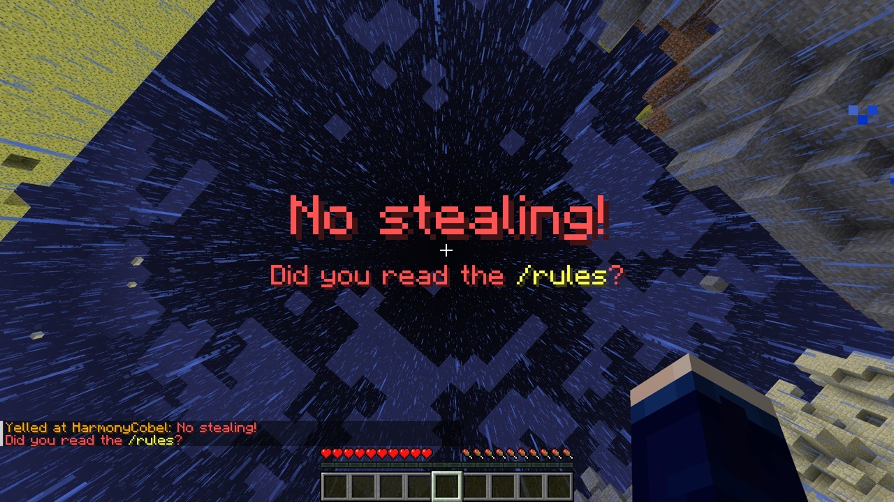

# AdminToolbox

Effective Minecraft moderation tools designed to prevent cheating, maintaining staff integrity and community trust.

**AdminToolbox natively supports [Folia][folia].**

## Features & Commands

### Spectate

`/spectate`, `/admin`, `/target`

Spectate at current location and enter admin mode. In admin mode, the player's inventory is cleared and restored when
they exit admin mode.

While spectating, the player can use the command again to exit admin mode. The player will be teleported back to their
original location, placed back into survival mode, and their original inventory will be restored.

#### Target Locations

- `/target` - Enter admin mode at current location
- `/target <player>` - Enter admin mode at a specified player's location
- `/target <x> <y> <z> [world]` - Enter admin mode at specific coordinates
- `/target <x> <z> [world]` - Enter admin mode at specific coordinates (uses the highest Y level at that location)

#### Targeting Spawn

`/spawn`, `/targetspawn`

- `/spawn` - Enter admin mode at the current world's spawn point
- `/spawn <world>` - Enter admin mode at the provided world's spawn point

#### Navigation

- `/back` - Move to previous location in teleport history
- `/forward` - Move to next location in teleport history

### Reveal

`/reveal`, `/show`

While in admin mode, running this command places the admin into survival mode at their current location. This makes the
admin visible to players during confrontations while maintaining:

- Empty inventory
- Immunity to damage
- No mob targeting

#### Fullbright

`/fullbright`, `/nightvision`

- `/fullbright` - Toggle fullbright for the current admin session
- `/fullbright <on|off>` - Enable or disable fullbright for the current admin session

### Yell

`/yell <player> <message>`

Forcibly displays a large red title on the targeted player's screen.
Use the pipe character (`|`) to separate title and subtitle: `title | subtitle`.

Legacy ampersand [color codes] are supported. (i.e. `Don't steal! | Please reread the &e/rules&r.`)

### Freeze

`/freeze <player>`

Stop a player from moving around, forcing them to stay in-place. Primarily useful during confrontations.

Frozen players:

- can still look around
- can still fall (useful if frozen in midair)
- cannot place or break blocks
- cannot take any damage
- cannot hurt other entities (including players)

To unfreeze a player, use `/unfreeze <player>`

### Streamer Mode

**Requires [LuckPerms](#integrations).**

`/streamermode <duration>`, `/pausealerts <duration>`

Allows players to temporarily disable certain permissions (i.e. those that give them staff-only alerts), intended for
screen sharing or live-streaming gameplay.

## Permissions

| Permission                            | Description                                                                                       |
|---------------------------------------|---------------------------------------------------------------------------------------------------|
| `admintoolbox.target`                 | Use [`/target`](#target-locations) at current location                                            |
| `admintoolbox.target.player`          | Use [`/target <player>`](#target-locations)                                                       |
| `admintoolbox.target.location`        | Use [`/target <x> [y] <z> [world]`](#target-locations)                                            |
| `admintoolbox.reveal`                 | Use [`/reveal`](#reveal)                                                                          |
| `admintoolbox.yell`                   | Use [`/yell`](#yell)                                                                              |
| `admintoolbox.freeze`                 | Use [`/freeze` and `/unfreeze`](#freeze)                                                          |
| `admintoolbox.spawn`                  | Use [`/spawn`](#targeting-spawn) in current world                                                 |
| `admintoolbox.spawn.all`              | Use [`/spawn [world]`](#targeting-spawn)                                                          |
| `admintoolbox.fullbright`             | Use [`/fullbright`](#fullbright) while in admin mode                                              |
| `admintoolbox.broadcast.receive`      | Receive alerts about others' [targets](#spectate), [yells](#yell), and [freeze](#freeze) actions. |
| `admintoolbox.broadcast.exempt`       | Do not send alerts to players with `admintoolbox.broadcast.receive`                               |
| `admintoolbox.streamermode`           | Use [streamer mode](#streamer-mode)                                                               |
| `admintoolbox.streamermode.unlimited` | Bypass maximum streamer mode duration. (Set in config.yml)                                        |

## Integrations

- **[LuckPerms](https://luckperms.net/)**
    - Required for [Streamer Mode](#streamer-mode).
    - **New in version 1.4.0:** Custom context for conditionally applying permissions based on admin state.
        - **`admintoolbox:state`** can be any of `spectating`, `revealed`, or `normal` (not in admin mode).
- **[BlueMap](https://bluemap.bluecolored.de)**
    - The plugin will hide admins who are [revealed](#reveal) from the map.

## Analytics

**Added in version 1.4.0.**

For us to better understand how many servers are using AdminToolbox, by default we collect anonymized analytics via
bStats. Server administrators can disable this functionality by setting `enable-stats: false` in config.yml.

The anonymized collected data is viewable publicly at https://bstats.org/plugin/bukkit/AdminToolbox/26406.

[folia]: https://papermc.io/software/folia

[color codes]: https://minecraft.wiki/w/Formatting_codes
